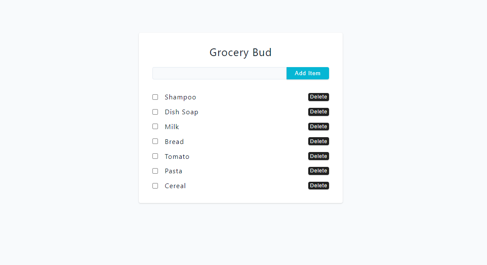
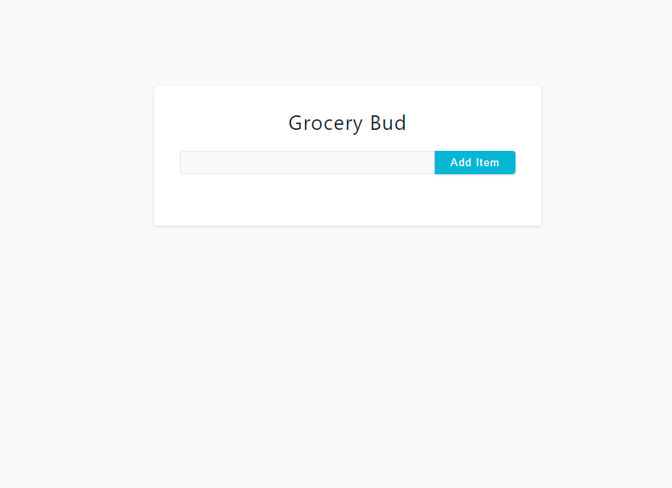
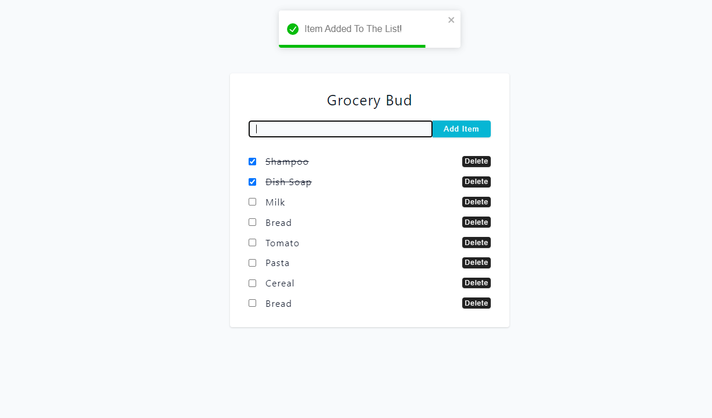
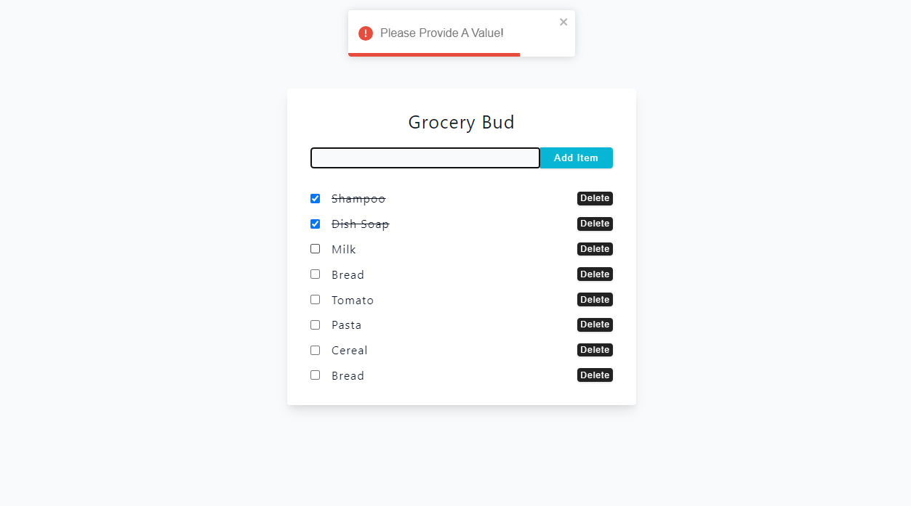

# Grocery Bud React Project

[Go to live demo](https://grocery-bud-rivki.netlify.app/)

## Overview

Welcome to **Grocery Bud**, a React project that simplifies managing your grocery list. Users can easily add items to the list, and the data is stored in the local storage of the user's device for convenient access.

## Features

- **Add Items:** Easily add grocery items to the list by entering the item name and clicking the "Submit" button.
- **Delete Items:** Each item in the list can be deleted.
- **Local Storage:** The added items persist in the local storage, providing a seamless experience across sessions.

## Technologies Used

- **React:** A powerful JavaScript library for building user interfaces.
- **Vite:** Used as the build tool for fast and efficient development.
- **React Toastify:** Integrated for displaying notifications.

## Screenshots

Feel free to explore and interact with the Grocery Bud app!
